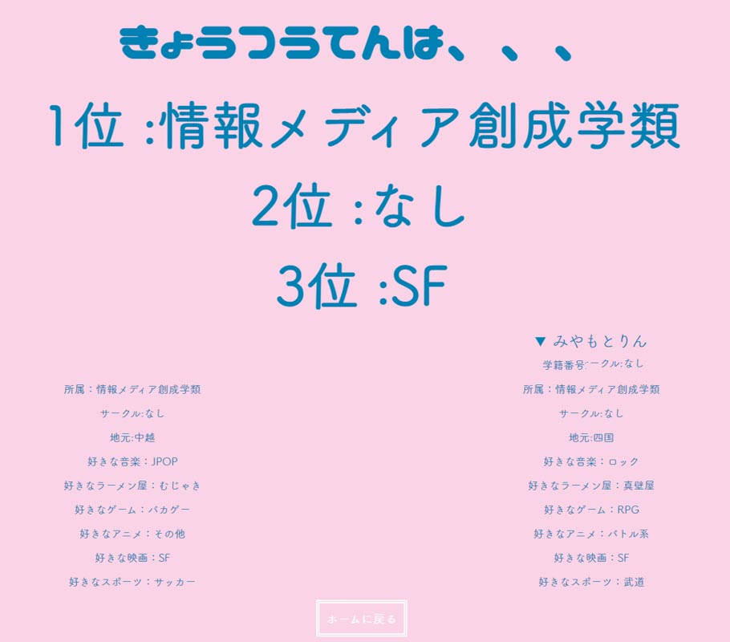

これは第3者も追記できるWiki的なポートフォリオです。
This is a wiki-style portfolio to which a third party can also add.

----------------------
# Rin Miyamoto 宮本凜

# Profile
2000年香川県木田郡牟礼町（現高松市）出身。  
筑波大学 情報メディア創成学類所属。  

# History

|Year|Content|
|:--|:--|
|2000|生誕|
|2003|保育所入所|
|2007|保育所退所、小学校入校|
|2008|YouTubeとニコニコ動画に触れる|
|2011|アメリカからのホームステイの受け入れをする|
|2013|小学校卒業、中学校入校   はじめてなんjの存在を知る同年代の人物に出会う|
|2016|中学校卒業、高校入学   人生の歯車が狂う|
|2017|筑波大学の存在を認知する|
|2019|高校卒業、浪人する|
|2020|4度目の正直で筑波大学情報メディア創成学類入学   天文研究会に入る   鹿の民になる|
|2021|初めてGoogle Maps APIを触る|
|2022|鹿の民をやめる   長期インターンのチャンスを自分の能力不足のせいでつぶす  enPiTでアジャイル開発を学ぶ   ハッカソンで努力賞をもらう   豊島美術館に衝撃を受ける   技育展に参加する   Digital Nature Groupに所属   授業で棺桶を作る   授業でゴミサービスを作る|

# Production
※中にリンク切れしているモノもあるかもしれません、ご了承ください

## つくとぴ(2023)

オンライン授業で初対面の人との会話をうまくいくようにするため、雑談支援ツールをチーム「高みのリーゼント」で作った。

## Funeral of my own(2022)

根底にあったのは、「死んでも楽しんでもらいたい」
自分を表現できる最後の機会＝自分の葬式として、自分の葬式をプロデュースしようと考え、まず棺桶を作った。